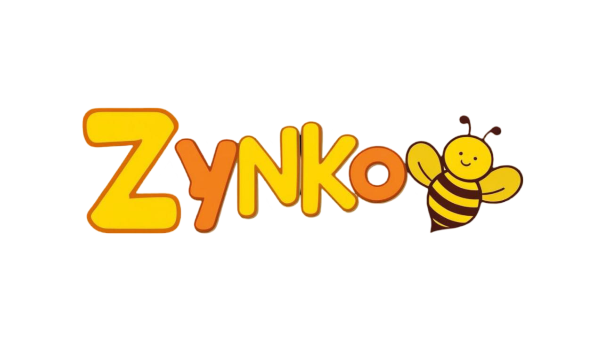

<div align="center">

  

  <h2>Zynko — Gamified Learning Platform for Rural Education (SIH25048)</h2>

  <p>
    <a href="https://reactnative.dev"></a>
    <a href="https://www.typescriptlang.org/"></a>
    <a href="https://firebase.google.com/"></a>
    
    
    
    
    
  </p>

</div>

## Zynko — Gamified Learning Platform for Rural Education (SIH25048)

Zynko is a mobile-first, offline-capable, gamified learning platform designed for students in rural schools (grades 6–12). It transforms STEM lessons into interactive, story-driven gameplay, improving engagement and concept mastery while running reliably on low-cost devices with intermittent connectivity.

### Problem Context
- Low engagement, limited access to quality STEM content, and poor internet connectivity hinder learning in rural regions.
- Zynko addresses this with multilingual content, offline-first delivery, and teacher analytics to drive outcomes.

### Expected Outcome
- Increase student engagement by 15%+ through game-based learning and continuous motivation.
- Provide analytics for teachers to track progress and remediate weak areas.

---

## ✨ Key Features
- **Curriculum-based gameplay**: Each lesson is a level with puzzles, missions, and story-led challenges.
- **Multilingual support**: Regional language availability to improve accessibility and comprehension.
- **Offline-first**: Lessons, quizzes, and progress tracking work offline; syncs when online.
- **Teacher dashboard (planned)**: Progress analytics, weak area detection, targeted assignments.
- **AI-driven peer community (planned)**: Instant feedback, safe discussions, peer help, guided by AI.
- **Gamified rewards**: Stars, badges, coins, quests, and leaderboards.

### Subject-Specific Game Modes
- **Math**: Puzzle unlocks, boss battles, treasure maps
- **Science**: Experiment simulator, mission mode, ecosystem builder
- **Technology**: Coding puzzles, innovation quests, build & fix

---

## 🧱 Architecture (High Level)
- **App (Mobile, React Native)**
  - Presentation/UI: React Native + TypeScript
  - Navigation: React Navigation (stack navigator)
  - State: Local component state for MVP; can expand to Redux/Zustand if needed
  - Media: Lottie animations, sound effects, splash/bootsplash
  - Offline: Local storage and asset bundling; deferred sync
- **Backend (MVP)**
  - Firebase Authentication (email/password, phone later)
  - Cloud Firestore for user profile and progress documents
  - Optional Cloud Functions for validations/analytics ETL (future)
- **Teacher Dashboard (Future)**
  - Web app (React/Next.js) backed by the same Firestore datasets

---

## 🧩 MVP Status (This Repository)
- ✅ Authentication flow and onboarding implemented (class, board, DOB capture)
- ✅ Boot splash, intro, and basic navigation
- ✅ Basic audio feedback and UI polish
- ⏳ Game loops, content modules, and analytics dashboard to follow

> Code highlights: see `src/screens/SignInScreen.tsx`, `src/screens/OnboardingScreen.tsx`, `src/navigation/AppNavigator.tsx`, and Firebase setup under `src/firebase/`.

---

## 🛠️ Tech Stack
- **Mobile App**: React Native, TypeScript
- **Navigation**: React Navigation (Native Stack)
- **Auth & Database**: Firebase Auth, Cloud Firestore (`@react-native-firebase/*`)
- **Animations**: Lottie (`src/components/LottiePlayer.tsx`), custom assets under `src/assets`
- **UI Utilities**: SweetAlert, custom fields (`InputField`, `DropdownField`, `DOBPicker`)
- **Media**: Bootsplash, background music, click sounds
- **Testing**: Jest (setup present)

---

## 📦 Project Structure (Selected)
```
src/
  navigation/           # AppNavigator and route setup
  screens/              # Screens (Intro, Onboarding, Dashboard, Auth)
  components/           # Reusable UI (InputField, DropdownField, etc.)
  firebase/             # Firebase initialization (native index)
  assets/               # Images, sounds, lottie
  audio/                # Music/sfx controls
```

---

## 🚀 Getting Started

Prerequisites
- Node.js 18+
- JDK 17 (Android)
- Android Studio with SDKs, or Xcode for iOS
- Yarn or npm

Install
```bash
npm install
# or
yarn
```

Start Metro
```bash
npm start
# or
yarn start
```

Android
```bash
npm run android
# or
yarn android
```

iOS
```bash
bundle install
bundle exec pod install --project-directory=ios
npm run ios
# or
yarn ios
```

Environment
- Firebase native configs are expected at `android/app/google-services.json` and iOS `GoogleService-Info.plist`.
- Update bundle IDs and app names per platform if you fork.

---

## 🌐 Offline-First Strategy
- Bundle core lessons, quizzes, and media with the app for immediate offline use.
- Cache user progress locally; sync diffs to Firestore when a connection is available.
- Use background sync policies (exponential backoff) to minimize data usage.
- Design assets to be small and optimized for low-spec devices.

---

## 📈 Analytics (Planned)
- Track per-concept mastery, time-on-task, attempt patterns, and hint usage.
- Teacher dashboard with cohort and individual views; export CSV/PDF.
- Early warning on disengagement and recommendations for remedial content.

---

## 🔐 Roles & Permissions (Roadmap)
- Student: learn, play, track personal progress, earn rewards
- Teacher: assign modules, view analytics, remediate
- Admin: manage content packs, languages, and releases

---

## 🗺️ Roadmap
- Game engine and level progression (Math/Science/Tech modules)
- Content packs in regional languages (phase-wise rollout)
- Adaptive difficulty and hinting with lightweight on-device models
- Leaderboards with school/cluster scoping and privacy controls
- Teacher web dashboard (React/Next.js)
- Enhanced offline packaging and delta updates

---

## 🖼️ Screenshots
Add your screenshots under `assets/screenshots/` and reference them here.

Example:
```markdown


```

Tips
- Capture at 1080x1920 (or device-native) and compress losslessly.
- Keep filenames lowercase with hyphens/underscores.

---

## 🤝 SIH 2025 — Problem Alignment
This project targets SIH Problem Statement SIH25048: “Gamified Learning Platform for Rural Education.”
- Multilingual, offline-first, and low-spec friendly by design
- Game-based pedagogy to raise engagement and outcomes
- Teacher analytics planned for targeted remediation

---

## 📜 License
Copyright © Team Winoverse.
All rights reserved. For SIH evaluation and demonstration purposes.

